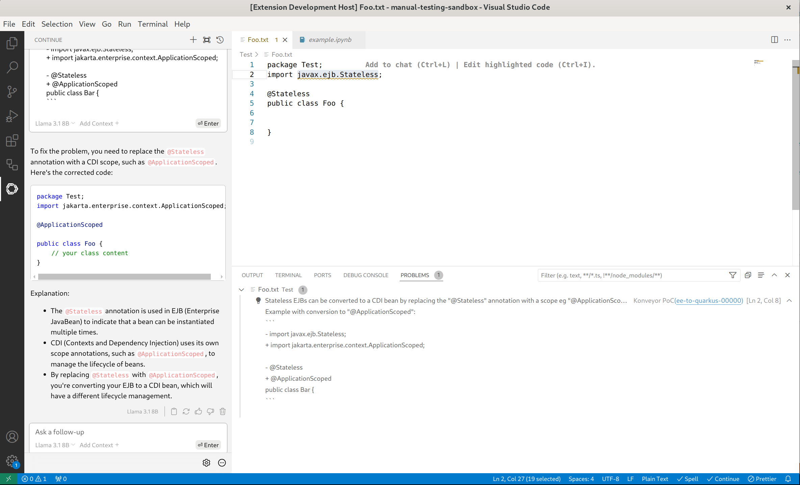
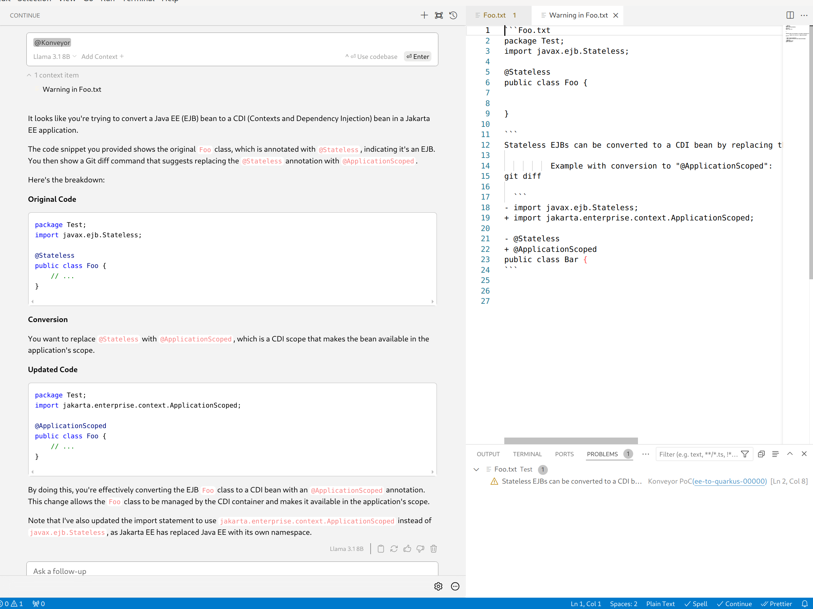
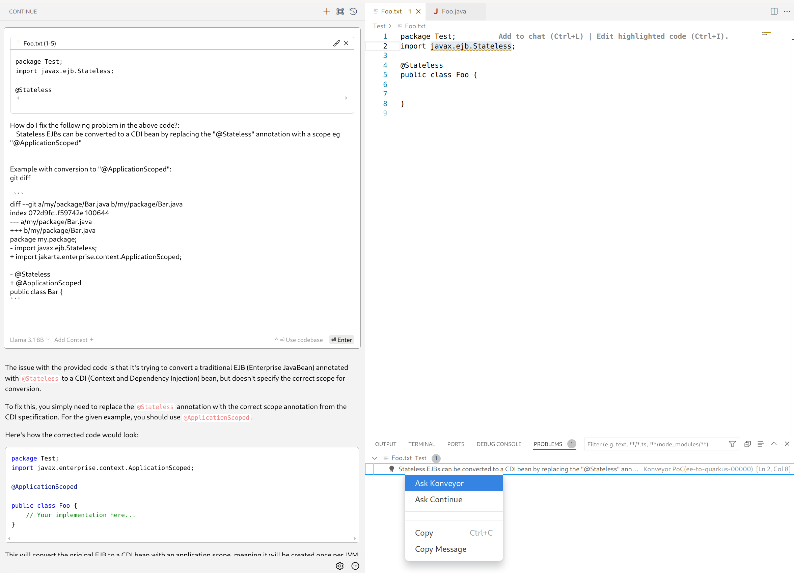

# konveyor-poc 

The goal of this PoC is to test integration between VS Code extensions: Konveyor and Continue.

## Testbed

Language server/client pair developed based on official [LSP sample extension](https://github.com/microsoft/vscode-extension-samples/tree/main/lsp-sample). 

Key points:
1. example has been reduced to updating diagnostic (removed i.e. configuration part and code completion)
2. file validation is based on a single hardcoded rule [ee-to-quarkus-00000](https://github.com/konveyor/rulesets/blob/main/default/generated/quarkus/200-ee-to-quarkus.windup.yaml). The rule is checked on-the-fly by simple regex search in the file content.

LLM model used: `llama3.1:8b`.
    
## Test results with built-in providers

Both `@Problems` provider and code action `Quick Fix -> Ask Continue` are able to provide reasonable code suggestions but their quality depends on the message retrieved from the problem marker. [The default message](https://github.com/rszwajko/konveyor-poc/blob/52d1f8547497094133b2a37336010ef7caefe23c/server/src/server.ts#L82) alone was not good enough.
Small adjustment like [providing the full package name](https://github.com/rszwajko/konveyor-poc/blob/52d1f8547497094133b2a37336010ef7caefe23c/server/src/server.ts#L85) solved the problem in most cases.
[LSP version 3.17(current)](https://microsoft.github.io/language-server-protocol/specifications/lsp/3.17/specification/) does not allow markup in the diagnostic message. This will change [in the next version](https://microsoft.github.io/language-server-protocol/specifications/lsp/3.18/specification/#diagnostic) but the model was able to understand [code snippets and pseudo-diffs](https://github.com/rszwajko/konveyor-poc/blob/52d1f8547497094133b2a37336010ef7caefe23c/server/src/server.ts#L90) provided using triple backticks notation. The snippets greatly improve the quality of fixes but look bad in the UI (unformatted, long text causing overflow).

## Custom Konveyor actions

1. `@Konveyor` context provider created from built-in `@Problems` provider - source available [here](https://github.com/rszwajko/konveyor-poc/blob/master/client/src/KonveyorProvider.ts)
2. `Quick Fix-> Ask Konveyor` code action created from built-in `Ask Continue` action - source available [here](https://github.com/rszwajko/konveyor-poc/blob/master/client/src/AskKonveyor.ts)

Both actions [provide the additional context](https://github.com/rszwajko/konveyor-poc/blob/52d1f8547497094133b2a37336010ef7caefe23c/client/src/data.ts#L4) based on the rule ID. The context is modelled as a list of solved incidents (git diffs) but it may be any helpful content.
The message visible in the markers is kept minimal (default rule message).

#### Code snippet inside message

#### @Konveyor
Note that the attached context item has been opened in a tab.

#### Ask Konveyor

## Lessons learned

1. context window size is important - i.e. the [default size of 2 lines above/below marker](https://github.com/continuedev/continue/blob/70d9bc5d52f328d94867a7eb08a41ace3ad06c17/core/context/providers/ProblemsContextProvider.ts#L30) used by `@Problems` provider was not enough for the test rule
2. message content needs to target not only the user (human) but also the LLM
3. [`diagnostic.code` property](https://github.com/rszwajko/konveyor-poc/blob/52d1f8547497094133b2a37336010ef7caefe23c/server/src/server.ts#L65) can be used by the client to retrieve the context over a dedicated channel. It's available for the code actions but unfortunately it's not passed [by Continue to context providers](https://github.com/continuedev/continue/blob/70d9bc5d52f328d94867a7eb08a41ace3ad06c17/core/index.d.ts#L417).
4. alternative way is to pass the data inside the [`diagnostic.data` blob](https://github.com/microsoft/vscode-languageserver-node/blob/8c5b095be0bb0fa28dac28f4d97512e489b38884/types/src/main.ts#L745). Unfortunately it's also only available in code actions (as for now).

## Running the PoC (dev mode only)

1. clone the project
2. `npm run install`
3. open project in VS Code
4. ensure that Continue extension is installed and connected to LLM
5. run the extension with `F5` key
 